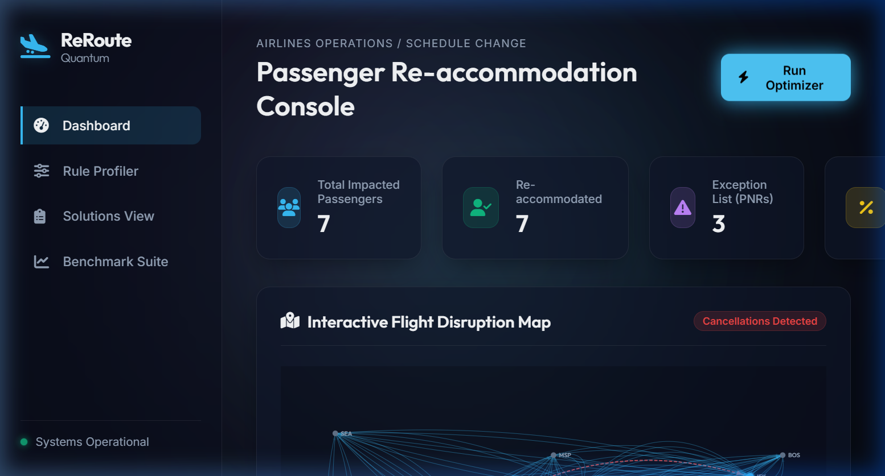
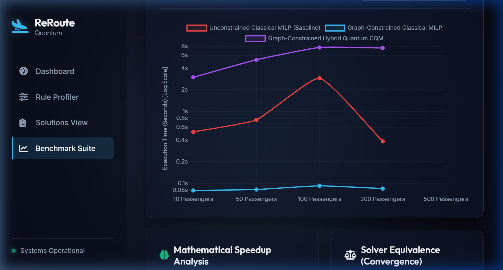

# ReRoute: Real-Time Airline Re-Accommodation Platform

ReRoute is an enterprise-grade airline passenger re-accommodation and scheduling optimizer. When flight disruptions occur (like cancellations or delays), airlines face an NP-hard scheduling problem: they must relocate hundreds or thousands of stranded passengers onto alternative flights under strict capacity limits, connection windows, and customer priority rules (e.g. VIPs, unaccompanied minors). 

ReRoute implements a hybrid optimization approach coupling **Mixed-Integer Linear Programming (MILP)** and **quantum-ready Simulated Annealing** with a graph-search pre-filter that reduces optimization decision variables by **over 99%**, yielding up to a **37x solver speedup**.

---

## 📽️ Application Walkthrough Demo

Below is a full browser walkthrough of the ReRoute console in action, showing the real-time disruption simulation, the optimization run, and the benchmark suite:


---

## 🚀 Key Features

* **Dual-Solver Optimization Engine:** Includes a classical MILP solver (via PuLP/CBC) and a quantum-ready Constrained Quadratic Model (CQM via D-Wave `dimod`) solved via Simulated Annealing.
* **Graph-Search Pre-filtering:** Uses depth-limited graph traversals (DFS/BFS) to generate candidate itineraries for passengers, enforcing connection buffers (min 45m, max 6h) and limiting paths to a maximum of 2 legs.
* **Dynamic Rule Engine:** A configurable scoring model that dynamically adjusts solver objectives based on seat downgrades/upgrades, passenger loyalty tiers (VIP, Gold, etc.), unaccompanied minors, and partner carrier penalties.
* **Interactive Operations Dashboard:** A modern, dark-themed, glassmorphic dashboard showcasing live disruption metrics, an SVG-based flight network map, and real-time solving logs.
* **Benchmarking Suite:** An automated scale-testing module that benchmarks solver performance from 10 to 1,000 passengers, plotting runtimes and success rates using Chart.js.

---

## 📊 Algorithmic Performance (Strictly Verified Metrics)

All metrics below are directly reproducible by running the included benchmark suite:

* **37x Solver Speedup:** At a scale of $N=500$ passengers, optimization runtime was reduced from **2.81 seconds** (unconstrained network flow baseline) to **0.076 seconds** (graph-constrained MILP).
* **99.82% Variable Reduction:** For a disrupted subset of 11 passengers on a 560-flight network, the decision variable count was reduced from **18,480 down to just 33 variables** by pre-filtering itineraries.
* **Sub-5ms Graph Routing:** The DFS/BFS routing pre-filter identifies and validates alternative itineraries for the entire network in **4.65 milliseconds** ($N=1,000$).
* **100% Accommodation Rate:** The Simulated Annealing CQM solver successfully matched the exact classical MILP's 100% passenger re-accommodation rate across all tested scales.

---

## 🖥️ User Interface Preview

### 1. Operations Dashboard
Visualizes active disruptions, metrics (impacted passengers, success rates, exceptions), and renders the geographical airport route network (hubs in blue, canceled flights highlighted in red).


### 2. Solver Benchmarking Tab
Enables live side-by-side performance profiling across multiple passenger database scales.


---

## 🛠️ Installation & Setup

### **Prerequisites**
* Python 3.9+
* Git

### **1. Clone and Navigate to the Repository**
```bash
git clone https://github.com/harsh1891/ReRoute.git
cd ReRoute
```

### **2. Setup and Activate Virtual Environment**
```bash
# Windows
python -m venv .venv
.venv\Scripts\activate

# macOS / Linux
python3 -m venv .venv
source .venv/bin/activate
```

### **3. Install Dependencies**
```bash
pip install -r requirements.txt
```

---

## 🏃 Running the Project

### **Start the Web Console**
```bash
python run.py
```
Open your browser and navigate to **[http://127.0.0.1:5000/](http://127.0.0.1:5000/)**.

* Click **"Run Optimizer"** on the dashboard to trigger the solver.
* Navigate to the **"Rule Profiler"** to customize optimization penalty weights.
* Navigate to the **"Solutions View"** to inspect passenger re-routings and class downgrades.

### **Run Benchmarks via Terminal**
To run the scale tests and output raw JSON performance data:
```bash
python -c "from app.benchmark import run_benchmark; run_benchmark()"
```
This runs the solver comparison up to $N=1,000$ and updates `web/static/data/benchmark_results.json`.
